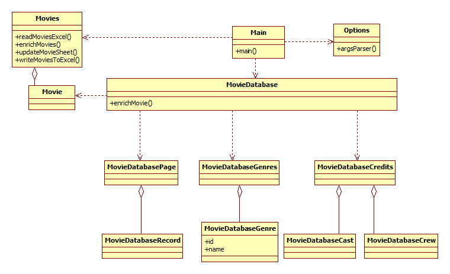

# Movie Download

## Introduction
This is a private application I wrote to enrich the excel sheet in which I maintain my movie collection with data from [The Movie Database](https://www.themoviedb.org/).
It is rather quick and dirty

## API Key
You need to provide an API key for The Movie Database in the file apikey.txt

## Excel file
An sample excel file is provided. Orange columns are columns you can fill in, the yellow columns are columns the application fills in.
You have to fill in the first two columns:
* Movie name
* Movie year
Then run the application.

## Usage
Build using maven:
```
mvn clean install
```

To run the application

```
java -jar MovieDownload.jar -f [input excel] -b [backup excel] -o [true/false] -a [true/false]
```

* -f Defines the input file
* -b The input file is updated, but before it is back upped for the case that the input file is destroyed
* -o Overwrite. By default once filled in fields are not overwritten. -o true overwrites.
* -a Indicates to process only the records that have not succesfully been processed, or all (-a true)

Or simply
```
java -jar MovieDownload.jar
```

This statement is equivalent to
```
java -jar MovieDownload.jar -f movies.xslx -b movies_backup.xslx -o false -a false
```

It processes the example file enclosed.

## Design
Next class diagram shows the classes


